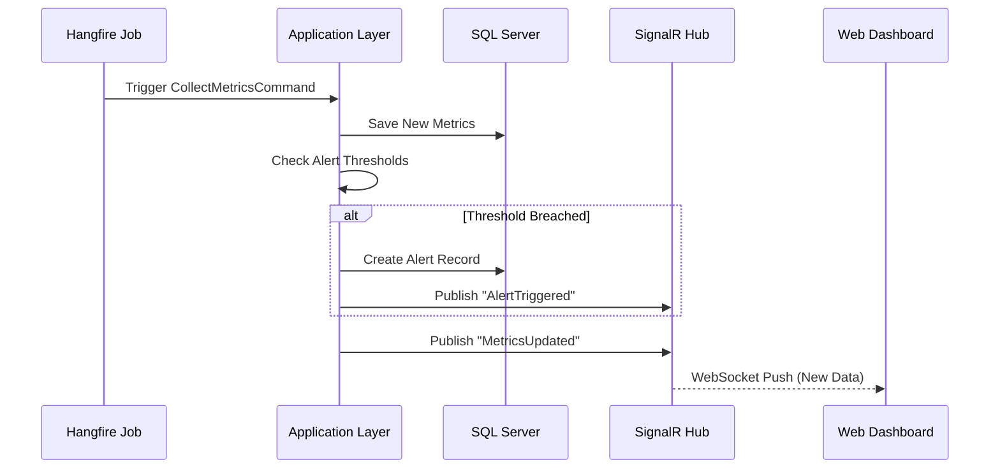
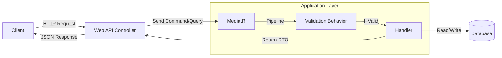

# 🏗️ InfraMonitor Architecture Documentation

This document provides a detailed technical overview of the **InfraMonitor** system architecture. It explains the design decisions, patterns, layers, and technologies used to build this scalable, real-time infrastructure monitoring solution.

---

## 📐 High-Level Architecture

InfraMonitor follows the **Clean Architecture** (also known as *Onion Architecture*) principles combined with **CQRS** (Command Query Responsibility Segregation). This ensures a clear separation of concerns, testability, and independence from external frameworks and drivers.

### Core Principles
1.  **Dependency Rule**: Source code dependencies only point inwards. Nothing in an inner circle can know anything at all about something in an outer circle.
2.  **Separation of Concerns**: The business logic is isolated from the UI, Database, and Frameworks.
3.  **Testability**: The core business rules can be tested without the UI, Database, or Web Server.

---

## 🏢 Layered Breakdown

The solution is divided into four main projects (layers):

### 1. **Domain Layer** (`InfraMonitor.Domain`)
*   **Role**: The enterprise business rules and entities.
*   **Dependencies**: None (Pure C#).
*   **Contents**:
    *   **Entities**: Core business objects (`Server`, `Metric`, `User`, `Alert`) with their properties and behaviors.
    *   **Value Objects**: Immutable objects defined by their attributes.
    *   **Enums**: Constants like `ServerStatus`, `MetricType`.
    *   **Events**: Domain events that signify important state changes.
    *   **Interfaces**: Repository contracts and abstraction definitions.

### 2. **Application Layer** (`InfraMonitor.Application`)
*   **Role**: The application business rules. Orchestrates the flow of data to and from the domain entities.
*   **Dependencies**: `InfraMonitor.Domain`.
*   **Patterns**: CQRS (via MediatR), Pipeline Behaviors.
*   **Contents**:
    *   **Commands**: Write operations (e.g., `CreateServerCommand`, `RegisterUserCommand`).
    *   **Queries**: Read operations (e.g., `GetServerDetailsQuery`, `GetAlertsQuery`).
    *   **Handlers**: Logic to process commands and queries.
    *   **Validators**: FluentValidation rules for input validation.
    *   **DTOs**: Data Transfer Objects to return data to the UI.
    *   **Interfaces**: Abstractions for infrastructure services (`IApplicationDbContext`, `IEmailService`, `ICurrentUserService`).
    *   **Behaviors**: Cross-cutting concerns like Logging, Validation, and Performance monitoring implemented as MediatR pipeline behaviors.

### 3. **Infrastructure Layer** (`InfraMonitor.Infrastructure`)
*   **Role**: Implements the interfaces defined in the Application layer. Acts as the adapter to external concerns.
*   **Dependencies**: `InfraMonitor.Application`, `InfraMonitor.Domain`.
*   **Contents**:
    *   **Persistence**: EF Core `DbContext` configuration, migrations, and database seeding.
    *   **Identity**: Implementation of `IdentityService` using JWT.
    *   **External Services**: Implementations for Email, Date/Time, File System interactions.
    *   **Background Jobs**: Hangfire configuration and job logic (e.g., `MetricCollectionJob`).
    *   **Logging**: Serilog configuration for PostgreSQL.

### 4. **Presentation/API Layer** (`InfraMonitor.WebAPI`)
*   **Role**: The entry point for the application.
*   **Dependencies**: `InfraMonitor.Application`, `InfraMonitor.Infrastructure`.
*   **Contents**:
    *   **Controllers**: RESTful API endpoints.
    *   **Hubs**: SignalR hubs for real-time WebSocket communication (`MonitoringHub`).
    *   **Middlewares**: Global exception handling, request logging.
    *   **Configuration**: `Program.cs`, Dependency Injection setup, `appsettings.json`.

---

## 🔄 Design Patterns & Key Technologies

### CQRS (Command Query Responsibility Segregation)
We split operations into **Commands** (Writes) and **Queries** (Reads).
*   **Benefits**: Allows independent scaling of read/write logic, optimized query DTOs preventing over-fetching, and simpler command (business logic) flows.
*   **Library**: **MediatR** is used to decouple the in-process sending of commands/queries to their handlers.

### Real-Time Updates
*   **Technology**: **SignalR**.
*   **Workflow**: When a new metric is collected or an alert is triggered, a domain event is published. A handler intercepts this and broadcasts the update to connected clients via the `MonitoringHub`.

### Background Processing
*   **Technology**: **Hangfire**.
*   **Use Cases**:
    *   **Recurring Jobs**: Polling server metrics every *N* minutes.
    *   **Fire-and-Forget**: Sending email notifications asynchronously when alerts trigger.

### Caching
*   **Technology**: **Redis**.
*   **Strategy**:
    *   **Distributed Cache**: Stores frequently accessed data (e.g., dashboard summaries) to reduce database load.
    *   **Output Caching**: API responses for static or semi-static data are cached.

### Logging & Monitoring
*   **Structured Logging**: **Serilog**.
*   **Sink**: Logs are written to **PostgreSQL** (`inframonitor_logs` database) for structured querying and analysis.
*   **Health Checks**: Built-in ASP.NET Core Health Checks verify connectivity to SQL Server, Redis, and Hangfire.

---

## 💾 Data Flow Diagrams

### 1. Metric Collection Flow

### 2. User Request Flow (CQRS)

---

## 🛠️ Infrastructure Setup

The entire stack is containerized using **Docker Compose**:

| Service | Container Name | Port | Description |
|:---|:---|:---|:---|
| **Web API** | `inframonitor.webapi` | `8080`, `8081` | The backend .NET application. |
| **SQL Server** | `inframonitor-sql` | `1433` | Primary relational database. |
| **PostgreSQL** | `inframonitor-logs-db` | `5432` | Dedicated logging database. |
| **Redis** | `inframonitor-redis` | `6379` | Distributed cache store. |
| **Frontend** | `Gama-frontend` | `4200` | Angular/React specific UI container. |

---

## 🔐 Security Architecture

1.  **Authentication**: JSON Web Tokens (JWT).
    *   Users log in via `/api/Auth/Login` to receive an access token.
    *   Tokens must be included in the `Authorization: Bearer <token>` header.
2.  **Authorization**: Role-Based Access Control (RBAC).
    *   `[Authorize(Roles = "Admin")]` attributes protect sensitive endpoints.
3.  **Data Protection**:
    *   Passwords are hashed using secure algorithms (BCrypt/Argon2) before storage.
    *   Sensitive interaction with the database is scoped purely to the Infrastructure layer.