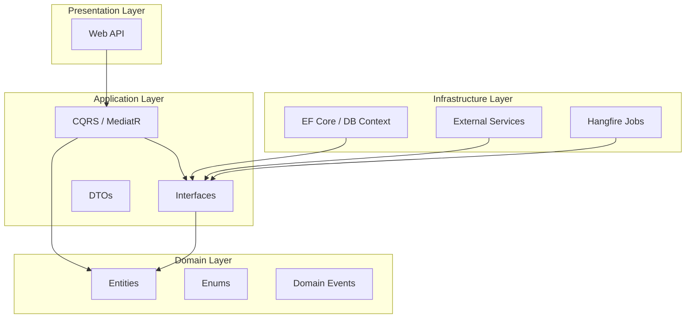

# 🖥️ InfraMonitor - Real-Time Infrastructure Monitoring

> A modern, scalable, and real-time infrastructure monitoring solution built with .NET 10 (Preview), CQRS, and Clean Architecture.

---

## 🚀 Project Overview

**InfraMonitor** is a comprehensive system designed to monitor servers in real-time. It provides live metrics (CPU, Memory, Disk, Response Time), intelligent alerting logic, and persistent historical data tracking.

The system leverages **SignalR** for instant updates to connected dashboards, **Hangfire** for scheduled background metric collection, and persistent storage using **SQL Server** and **PostgreSQL**.

### ✨ Key Features

- **Real-Time Monitoring**: Live updates via WebSocket (SignalR) every 2 seconds.
- **Intelligent Alerting**: Configurable threshold alerts (Email, SMS ready) for CPU, Memory, and Disk usage.
- **Background Jobs**: Automated data collection using Hangfire recurring jobs.
- **Clean Architecture**: Separation of concerns using Domain, Application, Infrastructure, and API layers.
- **Microservices Ready**: Designed with modular components for easy scaling.
- **Distributed Caching**: Redis integration for high-performance data retrieval.
- **Structured Logging**: Centralized logging with Serilog and PostgreSQL.
- **Secure API**: JWT Authentication and Role-Based Access Control (RBAC).

---

## 🛠️ Technology Stack

| Category | Technology | Purpose |
|----------|------------|---------|
| **Core** | .NET 10 (Preview) | Backend Framework |
| **Architecture** | Clean Architecture, CQRS | Design Pattern (MediatR) |
| **Data** | EF Core, SQL Server | Primary Database (ORM) |
| **Logs** | PostgreSQL (Serilog Sink) | Audit & Error Logs |
| **Cache** | Redis (StackExchange) | Output Caching & Rate Limiting |
| **Real-Time** | Azure SignalR / Core SignalR | WebSocket connections |
| **Jobs** | Hangfire | Background Processing |
| **Testing** | xUnit, Moq, FluentAssertions | Unit & Integration Testing |
| **Container** | Docker & Docker Compose | Containerization |

---

## 🏗️ Architecture

The solution follows the **Clean Architecture** principles:



---

## 🏁 Getting Started

### Prerequisites

Ensure you have the following installed:
- **.NET 8.0 SDK** (or later, project targets .NET 10 Preview)
- **Docker Desktop** (recommended for database setup)
- **SQL Server Management Studio (SSMS)** or Azure Data Studio
- **Visual Studio 2022** or **VS Code**

### 📥 Installation Steps

1. **Clone the repository:**
   ```bash
   git clone https://github.com/yourusername/InfraMonitor.git
   cd InfraMonitor
   ```

2. **Setup Infrastructure (Databases & Cache):**
   Use Docker Compose to spin up SQL Server, PostgreSQL, and Redis.
   ```bash
   docker-compose up -d
   ```
   > **Note:** Provide a valid SA password in `docker-compose.yml` if needed.

3. **Update Configuration:**
   Verify `appsettings.json` connection strings match your Docker setup.

4. **Apply Migrations:**
   ```bash
   dotnet ef database update --project InfraMonitor.Infrastructure --startup-project InfraMonitor.WebAPI
   ```

---

## 🏃 Running the Application

### Option 1: Running Locally (Visual Studio / CLI)

Run the Web API project:
```bash
dotnet run --project InfraMonitor.WebAPI
```
- **Swagger UI:** `https://localhost:63943/swagger`
- **Hangfire Dashboard:** `https://localhost:63943/hangfire` (Authorized users only)
- **Health Checks:** `https://localhost:63943/health`

### Option 2: Running with Docker

Build and run the entire stack including the API:
```bash
docker-compose --profile all up -d
```

---

## 🧪 Testing

The solution includes comprehensive Unit and Integration tests.

### Run All Tests
```bash
dotnet test
```

### Run Specific Test Project
```bash
dotnet test InfraMonitor.Tests
```

### Test Coverage
- **Domain Tests:** Validation logic and entity behaviors.
- **Application Tests:** Command/Query handlers and business logic.
- **Integration Tests:** API endpoints, Database interactions, and Auth flows.

---

## 📚 API Documentation

The API is documented using **Swagger/OpenAPI**.

- **Interactive Docs:** Launch the app and navigate to `/swagger`.
- **Authentication:** Use the `Authorize` button in Swagger. 
  1. Call `POST /api/v1/Auth/Register` to create a user.
  2. Call `POST /api/v1/Auth/Login` to get a Bearer Token.
  3. Paste the token as `Bearer <your-token>` in the authorization box.

---

## 🚧 Known Limitations & Future Improvements

While the system is robust, the following areas are identified for future enhancement:

1. **Frontend Implementation:** Complete the Angular/React dashboard integration (currently SignalR backend is ready).
2. **Performance Optimization:** Address potential N+1 query issues in metric collection jobs.
3. **Enhanced Security:** Implement stricter rate limiting and advanced comprehensive input validation.
4. **Historical Reporting:** Add visual charting for long-term historical data trends (currently available via raw API).
5. **Container Orchestration:** Add Kubernetes (K8s) manifests for production deployment.

---

